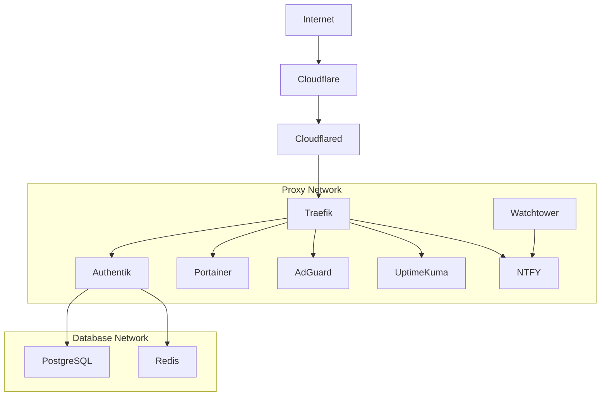

# Docker Infrastructure Documentation

## Overview

This document details the Docker infrastructure setup powering our homelab environment. The infrastructure is designed with the following key principles:

- **Security**: Using Authentik for authentication and Cloudflare for secure access
- **Modularity**: Services are organized in isolated networks (proxy, database)
- **Monitoring**: Integrated monitoring and updates through Watchtower
- **Management**: Centralized management via Portainer
- **Service Discovery**: Traefik handles routing and service discovery

## Table of Contents

- [Docker Infrastructure Documentation](#docker-infrastructure-documentation)
  - [Overview](#overview)
  - [Table of Contents](#table-of-contents)
  - [Service Reference](#service-reference)
  - [File Structure](#file-structure)
  - [Docker Infrastructure](#docker-infrastructure)
  - [Initial Setup Instructions](#initial-setup-instructions)
    - [1. Environment Setup](#1-environment-setup)
    - [2. Network Setup](#2-network-setup)
  - [Network Topology](#network-topology)
    - [Network Configuration](#network-configuration)
    - [Persistent Volumes](#persistent-volumes)
  - [Maintenance Procedures](#maintenance-procedures)
    - [Daily Operations](#daily-operations)
    - [Weekly Tasks](#weekly-tasks)
    - [Monthly Maintenance](#monthly-maintenance)
    - [Emergency Procedures](#emergency-procedures)
  - [Security and Auditing](#security-and-auditing)
    - [Security Best Practices](#security-best-practices)
    - [Security Auditing](#security-auditing)
    - [Monitoring and Alerting](#monitoring-and-alerting)

## Service Reference

| Service                                                               | Port Mappings            | Networks                   | Domain                    | Purpose                          | Documentation                                          |
| --------------------------------------------------------------------- | ------------------------ | -------------------------- | ------------------------- | -------------------------------- | ------------------------------------------------------ |
| [adguard](../services/adguard/docker-compose.yml)                     | 53 (TCP/UDP), 8989, 3333 | proxy                      | adguard.alimunee.com      | DNS and ad blocking              | [Link](../services/adguard/documentation.md)           |
| [AFFiNE](../services/AFFiNE/docker-compose.yml)                       | 3000                     | proxy                      | notes.alimunee.com        | Knowledge base (Notion/Miro alt) | [Link](../services/AFFiNE/documentation.md)            |
| [authentik](../services/authentik/docker-compose.yml)                 | 9999                     | proxy, db_network          | auth.alimunee.com         | Authentication service           | [Link](../services/authentik/documentation.md)         |
| [bazarr](../services/bazarr/docker-compose.yml)                       | 6767                     | proxy                      | bazarr.alimunee.com       | Subtitle management              | [Link](../services/bazarr/documentation.md)            |
| [chartdb-chartdb](../services/chartdb-chartdb/docker-compose.yml)     | 3000                     | proxy                      | dbdiagram.alimunee.com    | Database diagramming editor      | [Link](../services/chartdb-chartdb/documentation.md)   |
| [cloudflared](../services/cloudflared/docker-compose.yml)             | None                     | proxy                      | N/A (Cloudflare Tunnel)   | Cloudflare Tunnel                | [Link](../services/cloudflared/documentation.md)       |
| [convertx](../services/convertx/docker-compose.yml)                   | 3000                     | proxy                      | convert.alimunee.com      | Online file converter            | [Link](../services/convertx/documentation.md)          |
| [dozzle](../services/dozzle/docker-compose.yml)                       | 8080                     | proxy                      | logs.alimunee.com         | Docker log viewer                | [Link](../services/dozzle/documentation.md)            |
| [draw.io](../services/draw.io/docker-compose.yml)                     | 8080                     | proxy                      | diagram.alimunee.com      | Diagramming tool                 | [Link](../services/draw.io/documentation.md)           |
| [excalidraw](../services/excalidraw/docker-compose.yml)               | 80                       | proxy                      | draw.alimunee.com         | Collaborative whiteboard         | [Link](../services/excalidraw/documentation.md)        |
| [firefly-iii](../services/firefly-iii/docker-compose.yml)             | 8080                     | proxy, firefly_internal    | finance.alimunee.com      | Personal finance manager         | [Link](../services/firefly-iii/documentation.md)       |
| [flaresolverr](../services/flaresolverr/docker-compose.yml)           | 8191                     | proxy                      | flaresolverr.alimunee.com | Cloudflare bypass service        | [Link](../services/flaresolverr/documentation.md)      |
| [hoarder (Karakeep)](../services/hoarder/docker-compose.yml)          | 3000                     | proxy, karakeep_internal   | bookmarks.alimunee.com    | Bookmark manager (AI tagging)    | [Link](../services/hoarder/documentation.md)           |
| [homarr](../services/homarr/docker-compose.yml)                       | 7575                     | proxy                      | alimunee.com              | Dashboard                        | [Link](../services/homarr/documentation.md)            |
| [immich](../services/immich/docker-compose.yml)                       | 2283                     | proxy, immich_internal     | photos.alimunee.com       | Photo management system          | [Link](../services/immich/documentation.md)            |
| [it-tools](../services/it-tools/docker-compose.yml)                   | 80                       | proxy                      | tools.alimunee.com        | Developer/IT online tools        | [Link](../services/it-tools/documentation.md)          |
| [jellyfin](../services/jellyfin/docker-compose.yml)                   | 8096                     | proxy                      | tv.alimunee.com           | Media streaming service          | [Link](../services/jellyfin/documentation.md)          |
| [jellyseerr](../services/jellyseerr/docker-compose.yml)               | 5055                     | proxy                      | request.alimunee.com      | Media request management         | [Link](../services/jellyseerr/documentation.md)        |
| [joplin](../services/joplin/docker-compose.yml)                       | 22300                    | proxy, joplin_internal     | joplin.alimunee.com       | Note-taking sync server          | [Link](../services/joplin/documentation.md)            |
| [khoj-ai-khoj](../services/khoj-ai-khoj/docker-compose.yml)           | 8000                     | proxy                      | khoj.alimunee.com         | Personal AI assistant            | [Link](../services/khoj-ai-khoj/documentation.md)      |
| [kuma](../services/kuma/docker-compose.yml)                           | 3001                     | proxy                      | uptime.alimunee.com       | Monitoring and status page       | [Link](../services/kuma/documentation.md)              |
| [linkwarden](../services/linkwarden/)                                 | 3000                     | proxy, linkwarden_internal | links.alimunee.com        | Bookmark & link manager          | [Link](../services/linkwarden/documentation.md)        |
| [lobehub-lobe-chat](../services/lobehub-lobe-chat/docker-compose.yml) | 3210                     | proxy                      | chat.alimunee.com         | AI chat framework                | [Link](../services/lobehub-lobe-chat/documentation.md) |
| [n8n-io-n8n](../services/n8n-io-n8n/docker-compose.yml)               | 5678                     | proxy                      | automate.alimunee.com     | Workflow automation              | [Link](../services/n8n-io-n8n/documentation.md)        |
| [nextcloud](../services/nextcloud/docker-compose.yml)                 | 80                       | proxy, nextcloud_internal  | cloud.alimunee.com        | File storage & collaboration     | [Link](../services/nextcloud/documentation.md)         |
| [ntfy](../services/ntfy/docker-compose.yml)                           | 8888                     | proxy                      | ntfy.alimunee.com         | Notification service             | [Link](../services/ntfy/documentation.md)              |
| [ourstory](../services/ourstory/docker-compose.yml)                   | None                     | proxy                      | story.alimunee.com        | Platform for sharing stories     | [Link](../services/ourstory/documentation.md)          |
| [paperless-ngx](../services/paperless-ngx/docker-compose.yml)         | 8000                     | proxy, paperless_internal  | docs.alimunee.com         | Document management system       | [Link](../services/paperless-ngx/documentation.md)     |
| [prowlarr](../services/prowlarr/docker-compose.yml)                   | 9696                     | proxy                      | prowlarr.alimunee.com     | Indexer management               | [Link](../services/prowlarr/documentation.md)          |
| [qbit](../services/qbit/docker-compose.yml)                           | 8088, 6881               | proxy                      | qbit.alimunee.com         | Download client                  | [Link](../services/qbit/documentation.md)              |
| [radarr](../services/radarr/docker-compose.yml)                       | 7878                     | proxy                      | radarr.alimunee.com       | Movie collection manager         | [Link](../services/radarr/documentation.md)            |
| [scrutiny](../services/scrutiny/docker-compose.yml)                   | 8080                     | proxy                      | hdd.alimunee.com          | Hard drive health monitoring     | [Link](../services/scrutiny/documentation.md)          |
| [sonarr](../services/sonarr/docker-compose.yml)                       | 8989                     | proxy                      | sonarr.alimunee.com       | TV shows collection manager      | [Link](../services/sonarr/documentation.md)            |
| [stirling-pdf](../services/stirling-pdf/docker-compose.yml)           | 8080                     | proxy                      | pdf.alimunee.com          | PDF manipulation tool            | [Link](../services/stirling-pdf/documentation.md)      |
| [traefik](../services/traefik/docker-compose.yml)                     | 80, 443, 8080            | proxy                      | traefik.alimunee.com      | Edge router and reverse proxy    | [Link](../services/traefik/documentation.md)           |
| [vaultwarden](../services/vaultwarden/docker-compose.yml)             | 80, 3012                 | proxy                      | vault.alimunee.com        | Password manager                 | [Link](../services/vaultwarden/documentation.md)       |
| [watchtower](../services/watchtower/docker-compose.yml)               | None                     | proxy                      | N/A                       | Automated container updates      | [Link](../services/watchtower/documentation.md)        |

## File Structure

```plaintext
/storage
|-- Immich
|   |-- database
|   |-- model-cache
|   |-- uploads
|-- data
|   |-- adguard
|   |-- affine
|   |-- authentik
|   |-- bazarr
|   |-- chartdb
|   |-- convertx
|   |-- firefly-iii
|   |   |-- db
|   |   `-- upload
|   |-- jellyfin
|   |-- jellyseerr
|   |-- joplin
|   |-- joplin-db
|   |-- karakeep
|   |-- karakeep-meilisearch
|   |-- khoj
|   |-- lobe-chat
|   |-- n8n
|   |-- ntfy
|   |-- paperless
|   |   |-- consume
|   |   |-- data
|   |   |-- db
|   |   |-- export
|   |   `-- media
|   |-- portainer
|   |-- prowlarr
|   |-- qbittorrent
|   |-- radarr
|   |-- scrutiny
|   |-- sonarr
|   |-- stirling-pdf
|   |   |-- config
|   |   `-- storage
|   |-- tdarr
|   |-- traefik
|   |-- uptime-kuma
|   `-- vaultwarden
|       `-- data
|-- media
|   |-- anime
|   |-- download
|   |-- downloads
|   |-- movies
|   `-- tv
`-- nextcloud
```

## Docker Infrastructure

```bash
# Install Docker
apt install -y ca-certificates curl gnupg lsb-release
curl -fsSL https://download.docker.com/linux/debian/gpg | gpg --dearmor -o /usr/share/keyrings/docker-archive-keyring.gpg
echo "deb [arch=$(dpkg --print-architecture) signed-by=/usr/share/keyrings/docker-archive-keyring.gpg] https://download.docker.com/linux/debian $(lsb_release -cs) stable" | tee /etc/apt/sources.list.d/docker.list > /dev/null
apt update
apt install -y docker-ce docker-ce-cli containerd.io docker-compose-plugin

# Add user to docker group
usermod -aG docker $USER

# Configure Docker
cat << 'EOF' > /etc/docker/daemon.json
{
    "log-driver": "json-file",
    "log-opts": {
        "max-size": "10m",
        "max-file": "3"
    },
    "storage-driver": "btrfs"
}
EOF

docker network create proxy
docker network create database

# Enable and start Docker
systemctl enable --now docker
```

## Initial Setup Instructions

### 1. Environment Setup

```bash
mkdir -p /storage/data/{portainer,adguard/{work,conf},authentik/{media,certs},ntfy/{cache,etc}}
```

### 2. Network Setup

Create required Docker networks:

```bash
docker network create proxy
docker network create database
```

## Network Topology



### Network Configuration

Docker networks are segregated by purpose:

```plaintext
NETWORK ID     NAME       DRIVER    SCOPE
37f70a4f30e9   bridge     bridge    local
cee66a3b8a01   database   bridge    local
dd88aa295275   host       host      local
22df46ad34bf   none       null      local
e963823c489e   proxy      bridge    local
```

### Persistent Volumes

```plaintext
DRIVER    VOLUME NAME
local     portainer_data
```

**Performance Optimizations**:

- PHP parameters optimized (memory_limit, upload_max_filesize, opcache settings)
- Redis for memcache and locking
- PostgreSQL tuning
- Database maintenance via command-line tools

**Backup Procedures**:

- Automated Btrfs snapshots using Snapper
- PostgreSQL database dumps
- Configuration files backup

**Maintenance Commands**:

```bash
# Database optimization
docker exec -u www-data nextcloud php occ db:add-missing-indices
docker exec -u www-data nextcloud php occ maintenance:repair

# Storage cleanup
docker exec -u www-data nextcloud php occ trashbin:cleanup --all-users
docker exec -u www-data nextcloud php occ versions:cleanup

# System updates
docker exec -u www-data nextcloud php occ maintenance:mode --on
docker-compose pull
docker-compose up -d
docker exec -u www-data nextcloud php occ upgrade
docker exec -u www-data nextcloud php occ maintenance:mode --off
```

**Monitoring**:

- Integrated with Uptime Kuma for availability monitoring
- Notifications via NTFY
- Log monitoring for error detection

## Maintenance Procedures

### Daily Operations

```bash
# Check logs for specific service
docker logs --since 24h [service-name]

# Check logs for all services
docker logs $(docker ps -q) --since 24h

# Check container health
docker ps --format "table {{.Names}}\t{{.Status}}\t{{.Health}}"
```

### Weekly Tasks

```bash
# List all networks and their containers
docker network ls
docker network inspect proxy
docker network inspect database

# List volumes and usage
docker system df -v

# Prune unused volumes
docker volume prune --filter "label!=keep"
```

### Monthly Maintenance

```bash
# Manual update of excluded services
cd /path/to/service
docker-compose pull
docker-compose up -d

# Check for vulnerable packages
docker scan $(docker ps -q)

# Test backup restoration
cd /storage/backups
tar -tzvf docker_configs_*.tar.gz
```

### Emergency Procedures

```bash
# Quick service restart
docker-compose -f /path/to/service/docker-compose.yml restart [service-name]

# Full service rebuild
docker-compose -f /path/to/service/docker-compose.yml up -d --force-recreate
```

```bash
# Recreate networks
docker network rm proxy database
docker network create proxy
docker network create database

# Reconnect containers
docker-compose up -d
```

```bash
# Restore from backup
cd /storage/backups
tar -xzvf docker_configs_*.tar.gz -C /
docker-compose up -d
```

## Security and Auditing

### Security Best Practices

```bash
# Regular security scans
docker scan $(docker ps -q)

# Check container privileges
docker inspect --format '{{ .HostConfig.Privileged }}' $(docker ps -q)
```

### Security Auditing

```bash
# List exposed ports
docker ps --format "table {{.Names}}\t{{.Ports}}"

# Check network isolation
for net in $(docker network ls --format "{{.Name}}"); do
  echo "Network: $net"
  docker network inspect $net --format '{{range .Containers}}{{.Name}} {{end}}'
done
```

```bash
# Check container capabilities
docker inspect --format '{{ .HostConfig.CapAdd }}' $(docker ps -q)

# List mounted volumes
docker inspect --format '{{ .Mounts }}' $(docker ps -q)
```

### Monitoring and Alerting

```bash
# Container resource usage
docker stats --no-stream

# Disk usage alerts
docker system df -v | grep "Size:"
```
