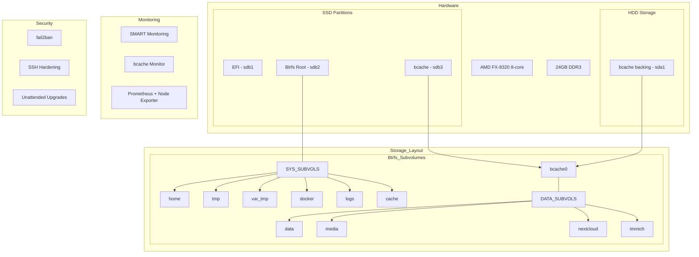

# System Setup and Configuration Documentation

## Environment Overview

```
       _,met$$$$$gg.          ali@homelab
    ,g$$$$$$$$$$$$$$$P.       -----------
  ,g$$P"     """Y$$.".        OS: Debian GNU/Linux 12 (bookworm) x86_64
 ,$$P'              `$$$.     Kernel: 6.1.0-31-amd64
',$$P       ,ggs.     `$$b:   Uptime: 14 hours, 52 mins
`d$$'     ,$P"'   .    $$$    Packages: 604 (dpkg)
 $$P      d$'     ,    $$P    Shell: bash 5.2.15
 $$:      $$.   -    ,d$$'    Resolution: 3840x2160
 $$;      Y$b._   _,d$P'      Terminal: /dev/pts/0
 Y$$.    `.`"Y$$$$P"'         CPU: AMD FX-8320 (8) @ 3.500GHz
 `$$b      "-.__              GPU: AMD ATI Radeon R9 285/380
  `Y$$                        Memory: 352MiB / 23929MiB
   `Y$$.
     `$$b.
       `Y$$b.
          `"Y$b._
              `"""
```

```plaintext
NAME        FSTYPE FSVER LABEL   UUID                                 FSAVAIL FSUSE% MOUNTPOINTS
sda
|-sda1      vfat   FAT32         141E-E9A0                             480.2M     1% /boot/efi
|-sda2      btrfs                bfa93949-5d6d-4eeb-86c7-fbcc59b585e8                /var/lib/docker/btrfs
|                                                                                    /var/tmp
|                                                                                    /var/log
|                                                                                    /var/lib/docker
|                                                                                    /var/cache
|                                                                                    /tmp
|                                                                                    /home
|                                                                                    /
`-sda3      bcache               45b54dbd-4768-4ffa-8078-f0f69b2734eb
  `-bcache0 btrfs                bb631e57-a7dd-41f5-bd22-92ab4bf0999f    3.6T     0% /storage/media
                                                                                     /storage/nextcloud
                                                                                     /storage/data
                                                                                     /storage/Immich
sdb
`-sdb1      bcache               dcca67d2-e59d-4c4f-a063-3e3ca44f92d8
  `-bcache0 btrfs                bb631e57-a7dd-41f5-bd22-92ab4bf0999f    3.6T     0% /storage/media
                                                                                     /storage/nextcloud
                                                                                     /storage/data
                                                                                     /storage/Immich
sdc
|-sdc1      exfat  1.0   Ventoy  B46D-F305
`-sdc2      vfat   FAT16 VTOYEFI 7353-81B1

```

```plaintext
Config    | Subvolume
----------+-------------------
home      | /home
immich    | /storage/Immich
nextcloud | /storage/nextcloud
root      | /

```

```plaintext
1: lo: <LOOPBACK,UP,LOWER_UP> mtu 65536 qdisc noqueue state UNKNOWN group default qlen 1000
    link/loopback 00:00:00:00:00:00 brd 00:00:00:00:00:00
    inet 127.0.0.1/8 scope host lo
       valid_lft forever preferred_lft forever
    inet6 ::1/128 scope host noprefixroute
       valid_lft forever preferred_lft forever
2: enp2s0: <BROADCAST,MULTICAST,UP,LOWER_UP> mtu 1500 qdisc fq_codel state UP group default qlen 1000
    link/ether 40:16:7e:b1:30:48 brd ff:ff:ff:ff:ff:ff
    inet 192.168.1.2/24 brd 192.168.1.255 scope global enp2s0
       valid_lft forever preferred_lft forever
    inet6 fe80::4216:7eff:feb1:3048/64 scope link
       valid_lft forever preferred_lft forever
```

### Btrfs Setup

The system uses a hybrid storage setup with an SSD for the system and a bcache-accelerated HDD for data storage.

#### SSD Partitions (256 GB)

OS + Docker Partition (116 GB):

- Purpose: Hosts OS, Docker images, containers, and critical system data
- Btrfs subvolumes enable granular snapshot management

bcache Partition (130 GB + 10GB Reserve):

- Purpose: Dedicated to bcache in write-back mode
- 10GB Reserve: Maintained for consistent performance
- Monitoring Setup:
  - Daily SMART attribute checks
  - Hourly bcache hit/miss ratio monitoring
  - Alert triggers:
    - Hit ratio drops below 70%
    - SSD health indicators show degradation
    - Cache dirty data exceeds 80% of capacity

##### Btrfs Subvolumes & Mount Points

@/ (mounted at /):

- Description: Contains OS and essential system files
- Mount Options: noatime, compress=zstd, space_cache
- Snapshot Policy: Daily automated snapshots + pre-update snapshots
- Quota: Maximum 20% for snapshots

@home (mounted at /home):

- Description: User data and personal configuration files
- Mount Options: noatime, compress=zstd
- Snapshot Policy: Weekly automated snapshots
- Quota: Maximum 30% for snapshots

- @: Root filesystem
- @home: User home directories
- @tmp: Temporary files
- @var_tmp: Variable temporary files
- @docker: Docker data
- @logs: System logs
- @cache: System cache

#### HDD Storage (4 TB)

Purpose: Organized into distinct Btrfs subvolumes for different data types

##### Data Subvolumes & Mount Points

@data (mounted at /storage/data):

- Description: General-purpose storage
- Mount Options: noatime, compress=zstd, space_cache
- Snapshot Policy: Weekly snapshots

@media (mounted at /storage/media):

- Description: Media files storage
- Mount Options: noatime, compress=zstd
- Snapshot Policy: Monthly snapshots

@nextcloud (mounted at /storage/nextcloud):

- Description: Nextcloud service data
- Mount Options: noatime, compress=zstd, max_inline=256
- Snapshot Policy: Daily snapshots
- Quota: Maximum 25% for snapshots

@immich (mounted at /storage/Immich):

- Description: Immich service data
- Mount Options: noatime, compress=zstd
- Snapshot Policy: Daily snapshots
- Quota: Maximum 25% for snapshots

@backup (mounted at /storage/backup):

- Description: Local backup storage
- Mount Options: noatime, compress=zstd
- Retention Policy:
  - Daily backups: 7 days
  - Weekly backups: 4 weeks
  - Monthly backups: 3 months

##### Data Subvolumes

- @data: General data storage
- @media: Media files
- @nextcloud: Nextcloud data
- @immich: Immich data

#### System Layout



### Snapper Configuration

The system uses Snapper for managing Btrfs snapshots with different configurations for various subvolumes:

#### Root Filesystem Configuration

```plaintext
TIMELINE_CREATE="yes"
TIMELINE_CLEANUP="yes"
TIMELINE_MIN_AGE="1800"
TIMELINE_LIMIT_HOURLY="5"
TIMELINE_LIMIT_DAILY="7"
TIMELINE_LIMIT_WEEKLY="4"
TIMELINE_LIMIT_MONTHLY="2"
SPACE_LIMIT="0.2"
FREE_LIMIT="0.2"
SUBVOLUME="/"
```

#### Home Directory Configuration

```plaintext
TIMELINE_CREATE="yes"
TIMELINE_CLEANUP="yes"
TIMELINE_LIMIT_HOURLY="1"
TIMELINE_LIMIT_DAILY="7"
TIMELINE_LIMIT_WEEKLY="0"
TIMELINE_LIMIT_MONTHLY="1"
SPACE_LIMIT="0.3"
FREE_LIMIT="0.2"
SUBVOLUME="/home"
```

#### Data Volumes Configuration

Nextcloud and Immich use similar configurations:

```plaintext
TIMELINE_CREATE="yes"
TIMELINE_CLEANUP="yes"
TIMELINE_LIMIT_HOURLY="5"
TIMELINE_LIMIT_DAILY="7"
TIMELINE_LIMIT_WEEKLY="4"
TIMELINE_LIMIT_MONTHLY="2"
SPACE_LIMIT="0.25"
FREE_LIMIT="0.2"
```

Specific subvolume paths:

- Nextcloud: `/storage/nextcloud`
- Immich: `/storage/Immich`

Common settings for all configurations:

- Background comparison enabled
- ACL synchronization enabled
- Empty pre/post snapshot cleanup
- Number-based cleanup with 10 snapshot limit

#### fstab

```plaintext
# /etc/fstab: static file system information.
#
# Use 'blkid' to print the universally unique identifier for a
# device; this may be used with UUID= as a more robust way to name devices
# that works even if disks are added and removed. See fstab(5).
#
# systemd generates mount units based on this file, see systemd.mount(5).
# Please run 'systemctl daemon-reload' after making changes here.
#
# <file system> <mount point>   <type>  <options>       <dump>  <pass>
# / was on /dev/sdb2 during installation
# SSD Partitions
UUID=141E-E9A0  /boot/efi       vfat    umask=0077      0       1
UUID=bfa93949-5d6d-4eeb-86c7-fbcc59b585e8 /               btrfs   defaults,noatime,compress=zstd:3,space_cache=v2,subvol=@       0       0
UUID=bfa93949-5d6d-4eeb-86c7-fbcc59b585e8 /home           btrfs   defaults,noatime,compress=zstd:3,space_cache=v2,subvol=@home     0       0
UUID=bfa93949-5d6d-4eeb-86c7-fbcc59b585e8 /tmp            btrfs   defaults,noatime,nodatacow,subvol=@tmp         0       0
UUID=bfa93949-5d6d-4eeb-86c7-fbcc59b585e8 /var/tmp        btrfs   defaults,noatime,nodatacow,subvol=@var_tmp     0       0
UUID=bfa93949-5d6d-4eeb-86c7-fbcc59b585e8 /var/lib/docker btrfs   defaults,noatime,compress=zstd:3,space_cache=v2,subvol=@docker   0       0
UUID=bfa93949-5d6d-4eeb-86c7-fbcc59b585e8 /var/log        btrfs   defaults,noatime,compress=zstd:3,space_cache=v2,subvol=@logs     0       0
UUID=bfa93949-5d6d-4eeb-86c7-fbcc59b585e8 /var/cache      btrfs   defaults,noatime,nodatacow,subvol=@cache       0       0

# HDD (bcache) Partitions
UUID=bb631e57-a7dd-41f5-bd22-92ab4bf0999f /storage/data           btrfs   defaults,noatime,compress=zstd:3,space_cache=v2,subvol=@data     0       0
UUID=bb631e57-a7dd-41f5-bd22-92ab4bf0999f /storage/media          btrfs   defaults,noatime,compress=zstd:3,space_cache=v2,subvol=@media    0       0
UUID=bb631e57-a7dd-41f5-bd22-92ab4bf0999f /storage/nextcloud      btrfs   defaults,noatime,compress=zstd:3,space_cache=v2,subvol=@nextcloud 0       0
UUID=bb631e57-a7dd-41f5-bd22-92ab4bf0999f /storage/Immich         btrfs   defaults,noatime,compress=zstd:3,space_cache=v2,subvol=@immich    0       0
```

### Maintenance Configuration

#### Btrfs Maintenance Timers

System-wide Btrfs maintenance tasks are configured using systemd timers:

```bash
# Service file: /etc/systemd/system/btrfs-scrub@.service
[Unit]
Description=Scrub btrfs filesystem mounted at %I
Documentation=man:btrfs-scrub

[Service]
Type=oneshot
ExecStart=/usr/sbin/btrfs scrub start -B %f
IOSchedulingClass=idle

# Timer file: /etc/systemd/system/btrfs-scrub@.timer
[Timer]
OnCalendar=monthly
AccuracySec=1d
Persistent=true
```

Similar configurations exist for balance operations:

```bash
# Service file: /etc/systemd/system/btrfs-balance@.service
ExecStart=/usr/sbin/btrfs balance start -dusage=50 -musage=50 %f

# Timer file: /etc/systemd/system/btrfs-balance@.timer
OnCalendar=weekly
```

TRIM operations are also scheduled weekly:

```bash
# Service file: /etc/systemd/system/btrfs-trim.service
[Unit]
Description=Trim Btrfs filesystems
Documentation=man:fstrim

[Service]
Type=oneshot
ExecStart=/usr/sbin/fstrim -Av

# Timer file: /etc/systemd/system/btrfs-trim.timer
[Unit]
Description=Run fstrim weekly on Btrfs filesystems

[Timer]
OnCalendar=weekly
AccuracySec=1h
Persistent=true
Unit=btrfs-trim.service

[Install]
WantedBy=timers.target
```

## System Security

### SSH Hardening

SSH configuration in `/etc/ssh/sshd_config`:

```plaintext
PermitRootLogin no
MaxAuthTries 3
PubkeyAuthentication yes
PasswordAuthentication no
PermitEmptyPasswords no
X11Forwarding no
MaxSessions 2
LoginGraceTime 30
```

### Unattended Upgrades

Configuration in `/etc/apt/apt.conf.d/50unattended-upgrades`:

```plaintext
Unattended-Upgrade::Automatic-Reboot "false";
Unattended-Upgrade::Automatic-Reboot-Time "02:00";
Unattended-Upgrade::Remove-Unused-Dependencies "true";
Unattended-Upgrade::Origins-Pattern {
    "origin=Debian,codename=${distro_codename},label=Debian";
    "origin=Debian,codename=${distro_codename},label=Debian-Security";
    "origin=Debian,codename=${distro_codename}-security,label=Debian-Security";
};
```

### Fail2ban Configuration

Basic configuration in `/etc/fail2ban/jail.local`:

```plaintext
[DEFAULT]
bantime = 1h
findtime = 10m
maxretry = 3

[sshd]
enabled = true
port = ssh
filter = sshd
logpath = /var/log/auth.log
maxretry = 3
```

## Monitoring Setup

### Prometheus Configuration

Basic Prometheus setup in `/etc/prometheus/prometheus.yml`:

```yaml
global:
  scrape_interval: 15s
  evaluation_interval: 15s

scrape_configs:
  - job_name: 'node'
    static_configs:
      - targets: ['localhost:9100']

  - job_name: 'prometheus'
    static_configs:
      - targets: ['localhost:9090']
```

### bcache Monitoring

A custom monitoring script tracks bcache performance and health. The script is deployed at `/usr/local/bin/bcache-monitor.sh` and runs as a systemd service.

#### Script Features

- Cache hit ratio monitoring (alerts below 70%)
- Dirty data percentage tracking (alerts above 80%)
- Device temperature monitoring (alerts above 70°C)
- SSD wear level monitoring (alerts below 50)
- SMART health status checks
- Performance statistics logging
- Notification system integration via ntfy

#### Configuration Files

```plaintext
# /etc/systemd/system/bcache-monitor.service
[Unit]
Description=Bcache Monitoring Service
After=network.target

[Service]
Type=oneshot
EnvironmentFile=/etc/default/notification-settings
ExecStart=/usr/local/bin/bcache-monitor.sh
User=root

[Install]
WantedBy=multi-user.target
```

```plaintext
# /etc/systemd/system/bcache-monitor.timer
[Unit]
Description=Run Bcache monitoring hourly

[Timer]
OnBootSec=5min
OnUnitActiveSec=1h
Persistent=true

[Install]
WantedBy=timers.target
```

```plaintext
# /etc/default/notification-settings
NTFY_URL="http://localhost:8080"
NTFY_DEFAULT_TOPIC="system-alerts"
```

```bash
# Configuration
# /usr/local/bin/bcache-monitor.sh

sudo cat /usr/local/bin/bcache-monitor.sh
#!/bin/bash

# Configuration
CACHE_DIR="/sys/block/bcache0/bcache"
CACHE_DEVICE="/dev/sdb3"
BACKING_DEVICE="/dev/sda1"
LOG_FILE="/var/log/bcache-monitor.log"
HIT_RATIO_THRESHOLD=70
DIRTY_DATA_THRESHOLD=80
TEMP_THRESHOLD=70
STATE_FILE="/var/lib/bcache-monitor-state"  # File to store last run's data

# ntfy configuration - simplified
NTFY_URL="https://ntfy.alimunee.com"
NTFY_USER="admin"
NTFY_PASS="pass123"
NTFY_TOPIC="bcache"  # Simplified topic name


send_notification() {
    local priority="$1"
    local message="$2"

    echo "$(date '+%Y-%m-%d %H:%M:%S') - Sending notification: $message" >> "$LOG_FILE"

    curl -s -u "${NTFY_USER}:${NTFY_PASS}" \
         -H "Priority: $priority" \
         -H "Title: Bcache Monitor Alert" \
         -H "Tags: storage,monitoring" \
         -d "$message" \
         "${NTFY_URL}/${NTFY_TOPIC}"
}

# Check required tools
for tool in bc bcache-super-show smartctl curl; do
    if ! command -v "$tool" &> /dev/null; then
        echo "$(date '+%Y-%m-%d %H:%M:%S') - $tool not found. Please install required packages." >> "$LOG_FILE"
        exit 1
    fi
done

# Check if bcache device exists
if [ ! -d "$CACHE_DIR" ]; then
    message="bcache device not found"
    echo "$(date '+%Y-%m-%d %H:%M:%S') - $message" >> "$LOG_FILE"
    send_notification "max" "$message"  # Changed from "urgent" to "max"
    exit 1
fi

# Load previous state, or initialize if it doesn't exist
if [ -f "$STATE_FILE" ]; then
    source "$STATE_FILE"
else
    prev_hits=0
    prev_misses=0
fi

# Get current stats
current_hits=$(( $(cat "$CACHE_DIR/stats_total/cache_hits") - 0 ))
current_misses=$(( $(cat "$CACHE_DIR/stats_total/cache_misses") - 0 ))

# Calculate delta (difference since last run)
delta_hits=$((current_hits - prev_hits))
delta_misses=$((current_misses - prev_misses))
delta_total=$((delta_hits + delta_misses))

# Calculate hit ratio since last run
if [ "$delta_total" -gt 0 ]; then
    delta_ratio=$(echo "scale=2; ($delta_hits * 100) / $delta_total" | bc)
    if (( $(echo "$delta_ratio < $HIT_RATIO_THRESHOLD" | bc -l) )); then
        message="Cache hit ratio (since last run) below ${HIT_RATIO_THRESHOLD}%: $delta_ratio%"
        echo "$(date '+%Y-%m-%d %H:%M:%S') - $message" >> "$LOG_FILE"
        send_notification "default" "$message"  # Changed from "warning" to "default"
    fi
else
    delta_ratio=0
    echo "$(date '+%Y-%m-%d %H:%M:%S') - No new cache activity since last run." >> "$LOG_FILE"
fi


# Save current stats for next run
echo "prev_hits=$current_hits" > "$STATE_FILE"
echo "prev_misses=$current_misses" >> "$STATE_FILE"


# Calculate overall hit ratio (for logging purposes, not for alerts)
total=$((current_hits + current_misses))
if [ "$total" -gt 0 ]; then
    overall_ratio=$(echo "scale=2; ($current_hits * 100) / $total" | bc)
else
    overall_ratio=0
fi


# Initialize dirty_data_percentage in case calculation below does not run
dirty_data_percentage=0

# Check dirty data with accurate calculation
dirty_data=$(cat "$CACHE_DIR/dirty_data")
cache_size=$(bcache-super-show "$CACHE_DEVICE" | grep -oP 'size=\K[0-9]+')
if [ -n "$cache_size" ] && [ "$cache_size" -gt 0 ]; then
    dirty_data_percentage=$(echo "scale=2; ($dirty_data * 100) / $cache_size" | bc)
    if (( $(echo "$dirty_data_percentage > $DIRTY_DATA_THRESHOLD" | bc -l) )); then
        message="Cache dirty data exceeds ${DIRTY_DATA_THRESHOLD}%: ${dirty_data_percentage}%"
        echo "$(date '+%Y-%m-%d %H:%M:%S') - $message" >> "$LOG_FILE"
        send_notification "high" "$message"
    fi
fi

# Check cache device health using smartctl
if command -v smartctl &> /dev/null; then
    health=$(sudo smartctl -H "$CACHE_DEVICE")
    if ! echo "$health" | grep -q "PASSED"; then
        message="WARNING: Cache device SMART health check failed"
        echo "$(date '+%Y-%m-%d %H:%M:%S') - $message" >> "$LOG_FILE"
        send_notification "max" "$message"  # Changed from "urgent" to "max"
    fi

    # Check SSD temperature
    temp=$(sudo smartctl -A "$CACHE_DEVICE" | grep "Temperature_Celsius" | awk '{print $10}')
    if [ -n "$temp" ] && [ "$temp" -gt "$TEMP_THRESHOLD" ]; then
        message="Cache device temperature critical: ${temp}°C"
        echo "$(date '+%Y-%m-%d %H:%M:%S') - $message" >> "$LOG_FILE"
        send_notification "high" "$message"
    fi

    # Check SSD wear level
    wear_level=$(sudo smartctl -A "$CACHE_DEVICE" | grep "Wear_Leveling_Count" | awk '{print $4}')
    if [ -n "$wear_level" ] && [ "$wear_level" -lt 50 ]; then
        message="WARNING: SSD wear level critical: $wear_level"
        echo "$(date '+%Y-%m-%d %H:%M:%S') - $message" >> "$LOG_FILE"
        send_notification "high" "$message"
    fi
fi

# Performance Statistics
{
    echo "$(date '+%Y-%m-%d %H:%M:%S') - Performance Stats:"
    echo "Cache Performance:"
    echo "  Hit Ratio (Since Last Run): ${delta_ratio}%"
    echo "  Overall Hit Ratio: ${overall_ratio}%"  # Added overall hit ratio
    echo "  Dirty Data: ${dirty_data_percentage}%"
    echo "  Cache Bypassed: $(cat "$CACHE_DIR/stats_total/bypassed")"
    echo "  Cache Hits (Since Last Run): $delta_hits"  # Delta hits
    echo "  Cache Misses (Since Last Run): $delta_misses" # Delta misses
    echo "  Total Cache Hits: $current_hits" #total hits
    echo "  Total Cache Misses: $current_misses" #total misses

    echo "Cache Settings:"
    if [ -f "$CACHE_DIR/sequential_cutoff" ]; then
        echo "  Sequential Cutoff: $(cat "$CACHE_DIR/sequential_cutoff")"
    fi

    # Device Information
    if [ -n "$temp" ]; then
        echo "Device Health:"
        echo "  Cache Device Temperature: ${temp}°C"
        if [ -n "$wear_level" ]; then
            echo "  SSD Wear Level: $wear_level"
        fi
    fi

    echo "----------------------------------------"
} >> "$LOG_FILE"

echo "----------------------------------------" >> "$LOG_FILE"
```

#### Monitored Metrics

- Cache hit/miss ratio
- Dirty data percentage
- Cache device temperature
- SSD wear level
- Device SMART status
- Cache bypass statistics
- Sequential cutoff settings

#### Log File

The script maintains detailed logs at `/var/log/bcache-monitor.log` including:

- Performance statistics
- Cache settings
- Device health information
- Alert notifications

#### Dependencies

- bc
- bcache-tools
- smartmontools
- curl (for notifications)

## Maintenance Schedule

### Daily Tasks

- SMART status checks
- Snapshot cleanup
- System logs check
- Backup verification

### Weekly Tasks

- Btrfs balance operations
- TRIM operations
- Docker cleanup
- Package cleanup

### Monthly Tasks

- Full system scrub
- Security audit
- Performance review
- Backup test restore

## Network Configuration

- Static IP: 192.168.1.2/24
- Interface: enp2s0
- Default Gateway: 192.168.1.1
- DNS:192.168.1.2 (AdGuard Home)

## Installed Services

Key monitoring and maintenance services:

- smartmontools
- prometheus
- prometheus-node-exporter
- fail2ban
- unattended-upgrades
- needrestart

## Maintenance Commands

### Check System Status

```bash
# Check btrfs status
sudo btrfs filesystem usage /

# Check bcache status
cat /sys/block/bcache0/bcache/stats_total/cache_hits
cat /sys/block/bcache0/bcache/stats_total/cache_misses

# Check systemd timers
sudo systemctl list-timers --all
```

### Maintenance Tasks

```bash
# Manual btrfs scrub
sudo btrfs scrub start /

# Manual balance
sudo btrfs balance start /

# Check fail2ban status
sudo fail2ban-client status

# Check sshd jail status specifically
sudo fail2ban-client status sshd
```

### AdGuard Settings

- Use AdGuard browsing security web service
- Use AdGuard parental control web service
- Use Safe Search for all available websites except YouTube because it disables comments
- Using the following lists:

| Filter Name                                      | URL                                                                  | Entries | Updated           |
| ------------------------------------------------ | -------------------------------------------------------------------- | ------- | ----------------- |
| AdGuard DNS filter                               | https://adguardteam.github.io/HostlistsRegistry/assets/filter_1.txt  | 55,465  | February 22, 2025 |
| AdAway Default Blocklist                         | https://adguardteam.github.io/HostlistsRegistry/assets/filter_2.txt  | 0       | –                 |
| Phishing URL Blocklist (PhishTank and OpenPhish) | https://adguardteam.github.io/HostlistsRegistry/assets/filter_30.txt | 1,500   | February 22, 2025 |
| uBlock₀ filters – Badware risks                  | https://adguardteam.github.io/HostlistsRegistry/assets/filter_50.txt | 2,881   | February 22, 2025 |
| 1Hosts (Lite)                                    | https://adguardteam.github.io/HostlistsRegistry/assets/filter_24.txt | 92,033  | February 22, 2025 |
| AdGuard DNS Popup Hosts filter                   | https://adguardteam.github.io/HostlistsRegistry/assets/filter_59.txt | 1,431   | February 22, 2025 |

## NFS Shared Storage Configuration

### Overview

The homelab includes an NFS shared folder implementation to enable seamless file sharing between the homelab server and client machines. The shared folder is implemented as a Btrfs subvolume on the bcache device and exported via NFS.

### Subvolume Configuration

| Setting        | Value                                                            |
| -------------- | ---------------------------------------------------------------- |
| Subvolume Name | `@shared`                                                        |
| Mount Point    | `/storage/shared`                                                |
| Device         | bcache0 (UUID: bb631e57-a7dd-41f5-bd22-92ab4bf0999f)             |
| Mount Options  | `defaults,noatime,compress=zstd:3,space_cache=v2,subvol=@shared` |
| Used For       | Project files, backups, and general file sharing                 |

### Btrfs Subvolume Updated Layout

```plaintext
bcache0 (bb631e57-a7dd-41f5-bd22-92ab4bf0999f)
├── @data        → /storage/data
├── @media       → /storage/media
├── @nextcloud   → /storage/nextcloud
├── @immich      → /storage/Immich
├── @backup      → (not currently mounted)
└── @shared      → /storage/shared
```

### NFS Server Setup

#### Package Installation

```bash
sudo apt update
sudo apt install nfs-kernel-server
```

#### Export Configuration

Location: `/etc/exports`

```plaintext
/storage/shared 192.168.1.0/24(rw,sync,no_subtree_check,no_root_squash)
```

#### NFS Service Management

```bash
# Apply configuration changes
sudo exportfs -a

# Restart service
sudo systemctl restart nfs-kernel-server

# Enable service on boot
sudo systemctl enable nfs-kernel-server
```

### Snapper Configuration for Shared Folder

```bash
# Snapper configuration for shared folder
sudo snapper -c shared create-config /storage/shared
```

#### Snapshot Settings

Location: `/etc/snapper/configs/shared`

```plaintext
TIMELINE_CREATE="yes"
TIMELINE_CLEANUP="yes"
TIMELINE_LIMIT_HOURLY="1"
TIMELINE_LIMIT_DAILY="7"
TIMELINE_LIMIT_WEEKLY="4"
TIMELINE_LIMIT_MONTHLY="2"
SPACE_LIMIT="0.25"
FREE_LIMIT="0.2"
SUBVOLUME="/storage/shared"
```

### Client Configuration

#### Fedora Client Setup

1. Package installation:

   ```bash
   sudo dnf install nfs-utils
   ```

2. Mount point creation:

   ```bash
   sudo mkdir -p /mnt/homelab-shared
   ```

3. FSTAB configuration:
   Location: `/etc/fstab`

   ```plaintext
   192.168.1.2:/storage/shared /mnt/homelab-shared nfs rw,_netdev,auto,soft,noatime,rsize=1048576,wsize=1048576,vers=4.2 0 0
   ```

4. SELinux configuration:
   ```bash
   sudo setsebool -P use_nfs_home_dirs 1
   ```

### NFS Maintenance Procedures

#### Server-Side Maintenance

- **Daily Operations**:

  - Check NFS service status: `sudo systemctl status nfs-kernel-server`
  - Monitor connected clients: `showmount -a localhost`

- **Weekly Tasks**:

  - Check for storage usage: `df -h /storage/shared`
  - Review logs for any issues: `sudo journalctl -u nfs-server`

- **Monthly Maintenance**:
  - Review and update exports if needed
  - Verify snapshot rotation is working correctly
  - Check for any security updates for NFS

#### NFS Troubleshooting

Common issues and resolutions:

1. **Connection issues**:

   - Check if NFS service is running: `systemctl status nfs-kernel-server`
   - Verify network connectivity: `ping client-ip-address`

2. **Permission issues**:

   - Check file ownership/permissions: `ls -la /storage/shared/`
   - On Fedora client, check SELinux: `getsebool -a | grep nfs`

3. **Performance issues**:
   - Test performance with: `dd if=/dev/zero of=/mnt/homelab-shared/testfile bs=1M count=1024 oflag=direct`
   - Consider adjusting rsize/wsize parameters

#### NFS Emergency Recovery

If NFS service fails:

```bash
sudo systemctl restart nfs-kernel-server
sudo exportfs -ra
```

If mount point becomes inaccessible:

```bash
sudo umount -f /mnt/homelab-shared
sudo mount -a
```

If data corruption occurs:

1. Check snapper snapshots: `sudo snapper -c shared list`
2. Restore from snapshot: `sudo snapper -c shared undochange NUMBER..NUMBER+1 /storage/shared/path/to/file`
